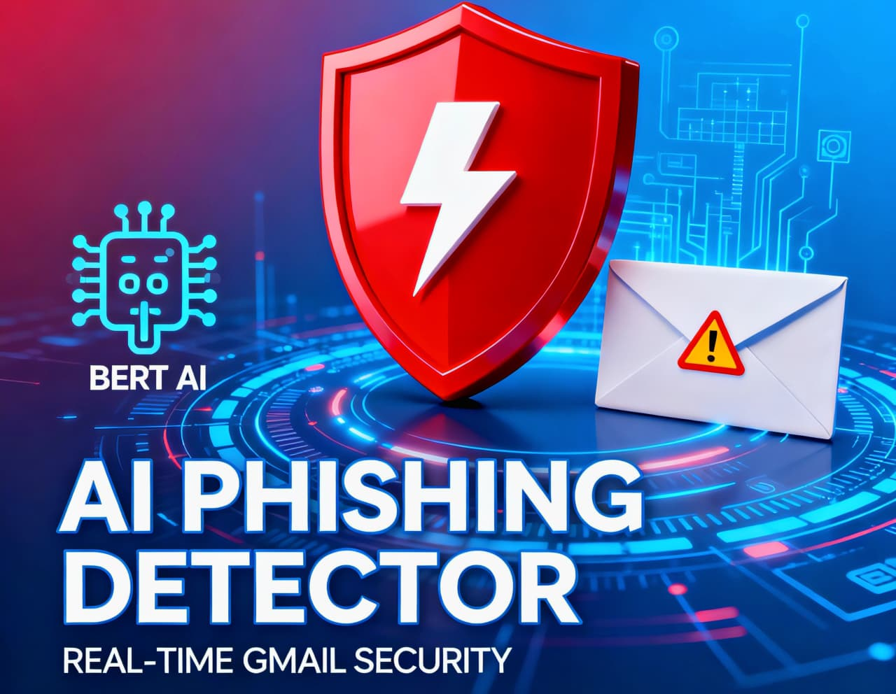

# AI Phishing Detector - Complete Project Guide

## Introduction

I created an **AI Phishing Detector** system as part of `Innovation Phase at Broskieshub.com` that automatically scans my mail inbox for phishing emails using a fine-tuned BERT machine learning model. The system includes:

- **Gmail Watcher:** A background Python script that monitors incoming emails every 5 minutes.
- **Flask API & Dashboard:** A web application for email analysis, scan history management, and reporting.
- **Intelligent Detection:** Uses transformers library with phishing detection model combined with URL and keyword analysis.

---

## 📹 Demo Video

**Click on image**

[](demo/main.mp4)

---

## Project Overview

### Architecture

1. **Gmail Watcher (`gmail_watcher.py`)**: Authenticates with Gmail API, fetches unread emails, sends them to the Flask API, labels them, and logs results to the database.

2. **Flask API (`app.py`)**: Hosts the AI model, provides an `/api/analyze` endpoint, manages scan history, and serves a web dashboard for filtering, exporting, and managing records.

3. **Shared Database**: SQLite database stores all scan records (both `scan_records.db` in root and `instance/scan_records.db`).

### Key Features

- **AI-Powered Detection**: BERT model (`ealvaradob/bert-finetuned-phishing`) for phishing probability scoring.
- **URL Analysis**: Identifies malicious patterns, IP addresses, shorteners, suspicious TLDs.
- **Keyword Detection**: Flags common phishing keywords (verify, claim, password, etc.).
- **Trusted Domain Whitelisting**: Skips phishing flag for emails from known trusted domains.
- **Gmail Labeling**: Automatically labels emails as "PhishScanAI-Phishing" or "PhishScanAI-Safe".
- **Email Notifications**: Sends alerts to your email on phishing detection.
- **Web Dashboard**: View scan history, filter by time/type, search, export CSV, soft-delete with undo.

---

## Prerequisites

- Python 3.9 or later
- Gmail account with Google Cloud API credentials
- Virtual environment support (recommended)
- 2GB+ RAM (for model loading)

---

## Step-by-Step Setup & Installation

### 1. Clone the Repository

```bash
git clone https://github.com/ultrew/Ai_Phishing_Detector.git
cd <your-repo>
```

### 2. Create and Activate Virtual Environment

#### Windows:
```bash
python -m venv venv
venv\Scripts\activate
```

#### Mac/Linux:
```bash
python -m venv venv
source venv/bin/activate
```

### 3. Install Dependencies

```bash
pip install -r requirements.txt
```

**Key packages installed:**
- Flask & Flask-SQLAlchemy (web framework & ORM)
- transformers & torch (AI model loading)
- google-auth-oauthlib & google-api-python-client (Gmail API)
- validators & requests (URL validation & HTTP)

### 4. Set Up Gmail API Credentials

I created OAuth 2.0 credentials from Google Cloud Console:

1. Go to [Google Cloud Console](https://console.cloud.google.com/)
2. Create a new project
3. Enable **Gmail API**
4. Create OAuth Client ID (**Desktop Application**)
5. Download the JSON file as **`credentials.json`**
6. Place `credentials.json` in your project root folder (same level as `app.py`)

**Important Scopes Used:**
- `gmail.readonly` - Read emails
- `gmail.modify` - Label emails
- `gmail.send` - Send notifications

The watcher will prompt you to authorize on first run, generating `token.pickle` for future authentication.

### 5. Configure Email and Database Paths

#### Update `gmail_watcher.py`:

Find and update this line with your email:

```python
NOTIFY_EMAIL = "yourmail@example.com"  # Change this to your Gmail address
```

This email receives phishing alerts.

#### Database Configuration:

- **Flask API (`app.py`)** uses:
  ```python
  app.config['SQLALCHEMY_DATABASE_URI'] = 'sqlite:///scan_records.db'
  ```
  Database location: `./scan_records.db` (main project root)

- **Gmail Watcher (`gmail_watcher.py`)** uses:
  ```python
  engine = create_engine('sqlite:///scan_records.db')
  ```
  Database location: `./scan_records.db` (main project root)

Both scripts share the same database for record consistency.

### 6. Create Database and Folder Structure

Ensure your project structure looks like this:

```
Ai_Phishing_Detector/
├── app.py
├── gmail_watcher.py
├── credentials.json          # Your Gmail API credentials
├── token.pickle              # Generated after first auth (auto-created)
├── scan_records.db           # SQLite database (auto-created)
├── requirements.txt
├── README.md
├── PROJECT_REPORT.md         # main report
├── templates/
│   └── index.html            # Dashboard HTML
├── venv/                     # Virtual environment
└── instance/                 # Optional, for Flask instance files
    └── scan_records.db       # Optional secondary database
```

### 7. Run the Flask API & Dashboard

In your terminal with virtual environment activated:

```bash
python app.py
```

**Output:**
```
Loading BERT model... (first time takes ~1 minute)
✓ Model loaded!
PhishShield AI - Running on http://localhost:5000
Open /scan-history in your browser
```

Access the dashboard at: **`http://localhost:5000/scan-history`**

### 8. Run Gmail Watcher (in a separate terminal)

Activate the virtual environment in a new terminal tab/window:

```bash
python gmail_watcher.py
```

**Output:**
```
Gmail authentication successful. Monitoring inbox...
Analyzing email from: sender@example.com | Subject: ...
LOGGED TO DB: sender | subject | Phishing? True/False | Score: XX.XX
```

The watcher runs indefinitely, checking for new unread emails every 5 minutes.

---

## How the System Works

### Email Analysis Pipeline

1. **Gmail Watcher** fetches unread emails from your inbox.
2. Extracts sender, subject, and body text.
3. Skips automated emails (noreply, postmaster, etc.) and labels them as safe.
4. Sends email to Flask API `/api/analyze` endpoint.
5. **Flask API** processes the email:
   - **Text Analysis**: Runs the BERT model, gets phishing probability (0-100%).
   - **URL Extraction**: Finds all URLs in the email.
   - **URL Risk Scoring**: Checks for IP addresses, shorteners, suspicious keywords, TLDs.
   - **Keyword Detection**: Identifies phishing keywords (verify, claim, password).
   - **Threat Score Calculation**: Combines all signals into final threat score (0-100%).
   - **Threat Level**: Categorizes as CRITICAL (75+), HIGH (50-74), MEDIUM (25-49), LOW (<25).
6. **Trusted Domain Filter**: If all URLs are from trusted domains, overrides phishing flag.
7. Gmail Watcher receives response, labels the email in Gmail.
8. If phishing detected, sends notification email to `NOTIFY_EMAIL`.
9. Logs result to SQLite database.

### Threat Scoring Algorithm

- **BERT Model Score**: 0-100% (base phishing probability)
- **Malicious URLs**: +20% per malicious URL (max +60%)
- **Suspicious Keywords (>3)**: +10%
- **Final Score**: Capped at 100%

### Trusted Domains

I've whitelisted major services to reduce false positives:
- Google, Microsoft, Apple, Amazon, PayPal, LinkedIn, Netflix, etc.
- 80+ trusted domains pre-configured

---

## Dashboard Features

### Home (`/scan-history`)

**View & Filter:**
- Scan history table with sender, subject, timestamp, phishing status, threat score.
- Search by sender or subject.
- Filter by: Phishing/Safe/All.
- Time range buttons: Last 1hr, Last 24hr, Last 7 days, All Time.

**Actions:**
- **Export CSV**: Download all records as CSV for reporting.
- **Delete**: Soft-delete individual records (marked but not erased).
- **Undo**: Restore a recently deleted record (1 action history).

**Pagination:**
- 10 records per page with Previous/Next navigation.

### API Endpoints

- `GET /api/health` - Health check (returns "healthy")
- `POST /api/analyze` - Send email for analysis (requires JSON with subject, sender, email_text)
- `GET /api/test-samples` - Get 3 test phishing/legitimate samples
- `GET /scan-history` - View dashboard with filters
- `POST /delete/<scan_id>` - Soft-delete a scan record
- `POST /undo-delete/<scan_id>` - Restore deleted record
- `GET /export` - Download all scan records as CSV

---

## Configuration & Customization

### Email Notification Address

In `gmail_watcher.py`, update:

```python
NOTIFY_EMAIL = "yourmail@example.com"
```

### Trusted Domains

To add more trusted domains, modify the `TRUSTED_DOMAINS` list in `gmail_watcher.py`:

```python
TRUSTED_DOMAINS = [
    "yourdomain.com",
    "anotherdomain.com",
    # ... add more
]
```

### Threat Score Thresholds

Modify threat levels in `app.py`:

```python
if threat_score >= 75:
    threat_level = "CRITICAL"
elif threat_score >= 50:
    threat_level = "HIGH"
elif threat_score >= 25:
    threat_level = "MEDIUM"
else:
    threat_level = "LOW"
```

### Scan Frequency

In `gmail_watcher.py`, at the end of `main()`:

```python
time.sleep(300)  # Scans every 5 minutes (300 seconds)
```

Change 300 to your desired interval in seconds.

---

## Database Management

### Database Files

I maintain two database files for flexibility:

1. **Main Root Database**: `./scan_records.db`
   - Used by both Flask API and Gmail Watcher
   - Shared storage for all scan records

2. **Instance Folder Database** (optional): `./instance/scan_records.db`
   - Can be used for isolated testing or deployment scenarios
   - Both files can coexist without conflict

### Database Schema

```sql
CREATE TABLE scan_record (
    id INTEGER PRIMARY KEY,
    sender VARCHAR(255),
    subject VARCHAR(500),
    scanned_at DATETIME DEFAULT CURRENT_TIMESTAMP,
    is_phishing BOOLEAN,
    threat_score FLOAT,
    recommendations TEXT,
    deleted BOOLEAN DEFAULT 0
);
```

### Soft Delete Column

The `deleted` column (BOOLEAN) enables soft deletes:
- `0 = Not deleted (visible in dashboard)`
- `1 = Deleted (hidden, can be restored)`

No data is permanently erased—only marked for deletion.

### Schema Updates

If you modify the database schema, run this Python script to migrate:

```python
import sqlite3

conn = sqlite3.connect('scan_records.db')
c = conn.cursor()
c.execute("ALTER TABLE scan_record ADD COLUMN deleted BOOLEAN DEFAULT 0")
conn.commit()
conn.close()
print("Migration complete!")
```

---

## Troubleshooting

### Issue: "Unable to Open Database File"

**Cause**: Database path is wrong, permissions issue, or file is locked.

**Solution**:
1. Verify `scan_records.db` exists in the project root.
2. Check file permissions (ensure your user can read/write).
3. Restart Python processes (close all terminals running Flask/Watcher).
4. Use `python -c "import os; print(os.path.abspath('scan_records.db'))"` to verify full path.

### Issue: Gmail Authentication Failed

**Cause**: Missing or invalid `credentials.json`.

**Solution**:
1. Ensure `credentials.json` is in project root.
2. Verify it's a valid OAuth Desktop Client JSON from Google Cloud.
3. Delete `token.pickle` and re-run watcher to trigger re-authorization.

### Issue: Model Takes Too Long to Load

**Cause**: First-time download of BERT model (~500MB).

**Solution**:
- First run takes 1-2 minutes to download and cache the model.
- Subsequent runs load from cache (takes <10 seconds).
- Ensure stable internet connection during first run.

### Issue: "No Such Column: scan_record.deleted"

**Cause**: Database schema doesn't have the `deleted` column.

**Solution**:
- Run the migration script above, or
- Delete `scan_records.db` and let Flask recreate it (loses history).

### Issue: Watcher Not Finding Emails

**Cause**: Gmail API scopes incomplete or no unread emails.

**Solution**:
1. Verify all 3 scopes are enabled in `credentials.json`.
2. Manually mark emails as unread in Gmail.
3. Check `DETECTOR_API_URL` points to running Flask app (default: `http://localhost:5000`).

---

## Development & Deployment Tips

### Running Both Services Locally

1. **Terminal 1**: Start Flask API
   ```bash
   python app.py
   ```

2. **Terminal 2**: Start Gmail Watcher
   ```bash
   python gmail_watcher.py
   ```

Both can run indefinitely. Use `Ctrl+C` to stop.

### Logging & Debugging

- Flask prints request logs to console.
- Watcher prints email analysis results.
- Check `scan_records.db` with SQLite Browser to inspect database.

### Production Considerations

- Change Flask `debug=False` in `app.py` for production.
- Use a production WSGI server (Gunicorn, uWSGI) instead of Flask dev server.
- Store credentials securely (environment variables, secrets manager).
- Set up logs to a file instead of console.
- Use a relational DB (PostgreSQL, MySQL) for large datasets instead of SQLite.

---

### .gitignore

I recommend adding these to `.gitignore`:

```
venv/
*.pyc
__pycache__/
.env
credentials.json
token.pickle
scan_records.db
instance/
.DS_Store
```

---

## Video Demo

For a full walkthrough of the system in action, refer to the included **video demo**. It shows:
- Dashboard navigation and filtering
- Email analysis in real-time
- CSV export
- Database management

---

## License

This project is open source and available for personal and educational use.

---

## Support & Questions

If you encounter issues:

1. Check the **Troubleshooting** section above.
2. Verify all prerequisites are met.
3. Ensure `credentials.json` is correctly placed.
4. Check Flask and Watcher are running in separate terminals.
5. Review console output for error messages.

---

## Acknowledgments

- **BERT Model**: `ealvaradob/bert-finetuned-phishing` from Hugging Face
- **Gmail API**: Google Cloud Platform
- **Framework**: Flask & SQLAlchemy

---

**Built with ❤️ for cybersecurity awareness and email safety.**
